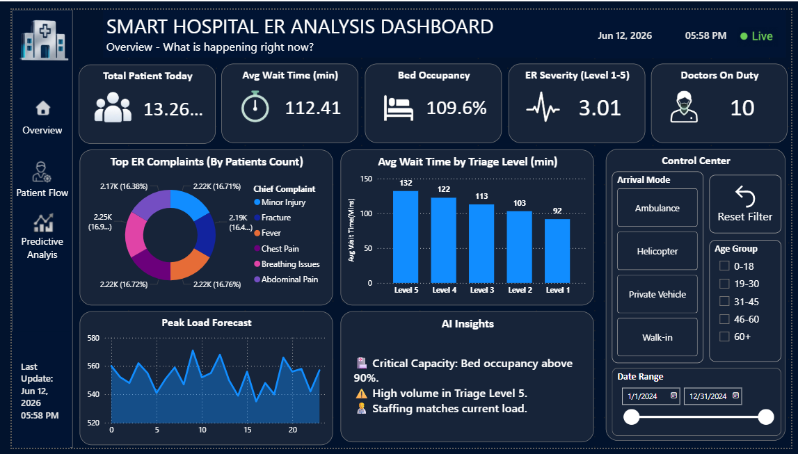
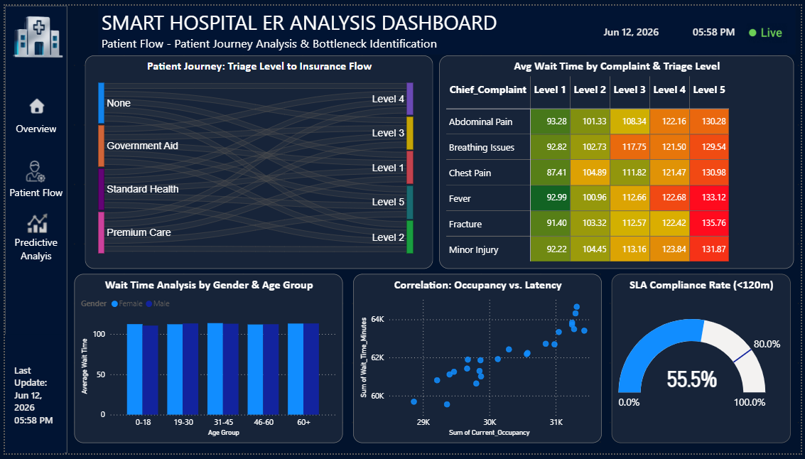
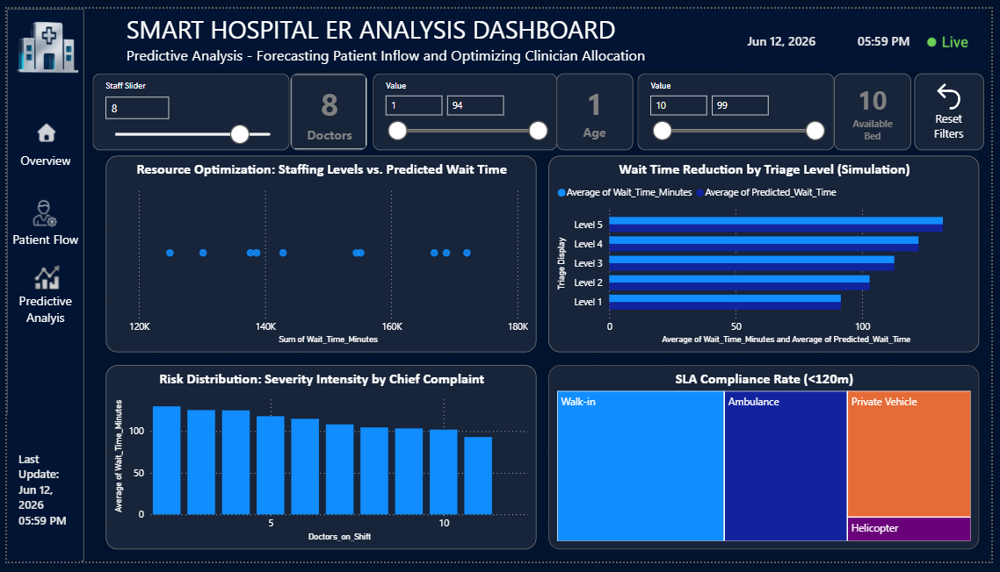

# Smart Hospital ER Analytics: Predictive Modeling & Visual Insights

## 📌 Project Overview
This repository contains an end-to-end analytics and machine learning workflow designed to optimize Emergency Room (ER) operations. By leveraging a simulated dataset of over 13,000 patient records (`Smart_Hospital_ER_Final.csv`), the project analyzes the impact of structural bottlenecks (such as triage levels, occupancy rates, and staffing constraints) on patient wait times. 

The project features a **Scikit-Learn predictive framework** engineered via Python (`Smart_Hospital_ER_Analytics.ipynb`) paired with a **dynamic 3-page Power BI executive dashboard** (`SMART_HOSPITAL_ER_ANALYSIS.pbix`) to translate data predictions into actionable hospital staffing strategies.

---

## 📊 Executive Dashboard Preview
The interactive dashboard translates predictive pipelines into a decision-making interface across three core tabs:

### 1. Operations Overview
Monitors live operational health metrics, active complaints, and volume distribution.


### 2. Patient Flow & Bottleneck Analysis
Traces insurance-to-triage journeys and maps triage severity vs. complaint latency.


### 3. Predictive Analysis & Resource Optimization
Features parameter simulation variables ("What-If" sliders) to dynamically forecast clinical SLA impacts.


---

## 🔍 Data-Driven Operational Insights

### 1. The Paradox of Low-Acuity Triage Latency (From Overview_pg.png)
*   **The Finding:** The "Avg Wait Time by Triage Level" chart reveals a critical trend: **Triage Level 5 (Non-urgent)** experiences the highest average wait time at **132 minutes**, whereas **Triage Level 1 (Resuscitation)** is processed quickest at **92 minutes**. 
*   **Operational Context:** Lower-acuity complaints are consistently de-prioritized to keep high-risk patients safe, causing non-urgent cases to pile up.
*   **Recommendation:** Deploy a fast-track minor care pathway dedicated to Level 4 and 5 patients to offload demand from the primary emergency care queue.

### 2. Critical Threshold Overload & SLA Crises (From Patient_flow_pg.png)
*   **The Finding:** The "Correlation: Occupancy vs. Latency" scatter plot establishes a clear positive correlation where aggregate wait time escalates as total patient occupancy rises. Consequently, the hospital's **SLA Compliance Rate (<120m) sits at a critical 55.5%**.
*   **Operational Context:** The matrix table highlights that **Fever (133.12 mins)** and **Fractures (135.76 mins)** crossing into Level 5 triage are severe drivers of compliance drops.
*   **Recommendation:** When live occupancy metrics threaten the 55.5% SLA baseline, activate dynamic text notifications to divert low-severity walk-ins to affiliated urgent care centers.

### 3. Simulating Resource Relief via What-If Modeling (From Predictive_analysis__pg.png)
*   **The Finding:** The "Wait Time Reduction by Triage Level (Simulation)" chart validates the predictive modeling layer, displaying a side-by-side comparison of actual wait times against the machine learning model's `Average of Predicted_Wait_Time`.
*   **Operational Context:** By scaling active staffing inputs via the dashboard controls, management can instantly see the projected flattening of wait times across all 5 Triage Levels. 
*   **Recommendation:** Integrate this simulation tool into weekly scheduling workflows to pre-schedule clinicians based on predictive seasonal inflow peaks.

---

## 🛠️ Repository File Structure
As shown in `image_a16cdc.png`, the repository is organized cleanly at the root directory level:
```text
├── .gitignore                   # Prevents tracking local checkpoint data
├── Overview_pg.png              # Power BI Dashboard Page 1 Screenshot
├── Patient_flow_pg.png          # Power BI Dashboard Page 2 Screenshot
├── Predictive_analysis__pg.png  # Power BI Dashboard Page 3 Screenshot
├── README.md                    # Detailed project documentation
├── SMART_HOSPITAL_ER_ANALYSIS.pbix # Full Power BI dashboard file
├── Smart_Hospital_ER_Analytics.ipynb # Data generation, engineering, and ML pipeline
├── Smart_Hospital_ER_Final.csv  # Final generated healthcare dataset 
└── requirements.txt             # Python environment dependencies
